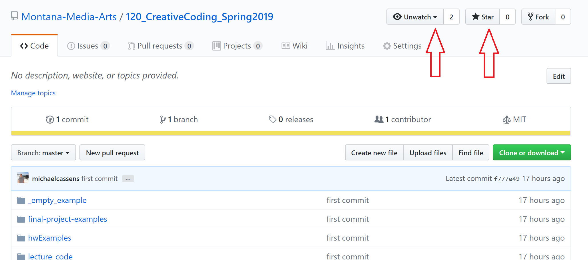
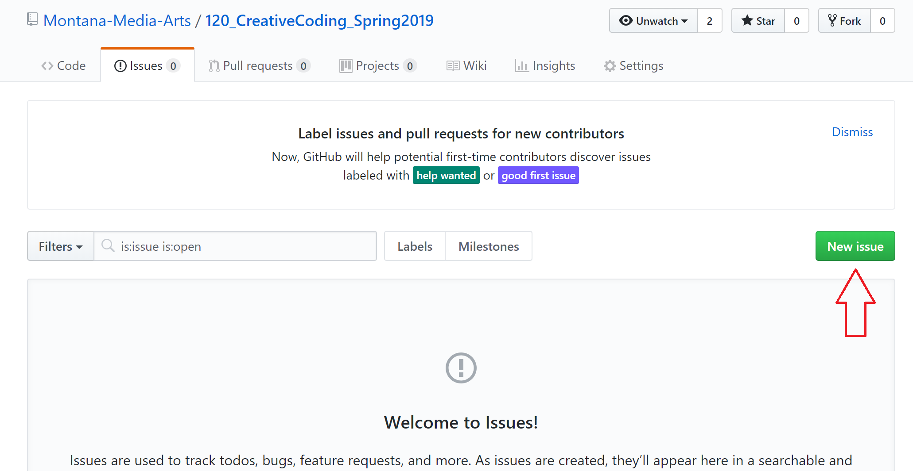

<!--# Get a clone on your local Machine-->

# _Issues Forum_ and Notifications from GitHub.com

<iframe width="560" height="315" src="https://www.youtube.com/embed/Bw5tn4yL-bw" frameborder="0" allow="accelerometer; autoplay; encrypted-media; gyroscope; picture-in-picture" allowfullscreen></iframe>

This class is heavily utilizing [GitHub.com](https://github.com). Not only is this service where you will host your git repo's and live websites, but this content site lives in GitHub and there is a "resources" repo for this site that contains;

- code examples for this course
- and an issues forum where you can ask each other for help.

## "Watch" and Star The Course Resource Repository

By "watching" the course repository you will be get notifications about new issues as well as when new resources become available.

To watch the course repo:

- Navigate to [https://github.com/Montana-Media-Arts/120_CreativeCoding_Fall2019](https://github.com/Montana-Media-Arts/120_CreativeCoding_Fall2019/issues). This issues forum for this site is also linked to from the "Issues-Forum" tab above in the navbar.
- In the upper right-hand corner, you should select both "watching" and "star".
    - This will allow GitHub to e-mail you about notifications and issues in the course repo.
    - **Part of your grade for this course is based on _participation_. This is how you participate.**
        - When you have problems, post them here.
        - If you get an email about a new issue, try to help the person out.

## Create a new “Issue”

To create or respond to an issue, open the repo ["Issues Forum"](https://github.com/Montana-Media-Arts/120_CreativeCoding_Fall2019-Samples/issues).

There you can search open issues to try and;

- get yourself help
- or help a colleague

If no issue matches your problem, you can open a "New Issue". This allows you to describe your problem, thereby allows everyone in the class to help work on it.

NOTE: You should not repeat a comment that has already been added by anyone from your class. However, if you would like to further a comment already there, “@mention” the classmate/user and continue their discussion.

# Create your own GitHub repository

<iframe width="560" height="315" src="https://www.youtube.com/embed/mxQO3Pv_QGY" frameborder="0" allow="accelerometer; autoplay; encrypted-media; gyroscope; picture-in-picture" allowfullscreen></iframe>

You want to create your own repository if you don't have one. 
1. Go to ([GitHub](https://github.com))
2. Create an account by clicking Sign up for GitHub.
3. View your repositories.

# GitHub Desktop

<iframe width="560" height="315" src="https://www.youtube.com/embed/Wbex3if4ogM" frameborder="0" allow="accelerometer; autoplay; encrypted-media; gyroscope; picture-in-picture" allowfullscreen></iframe>

This is a graphical interface to make a copy of your repository on your computer.  Then, you can make changes to your work and then easily post it back to your repository.  Or if you heaven forbid something happens to your computer [trust me, it happens] then you have a back up.

1. Go to ([GitHub Desktop](https://desktop.github.com/))
2. Download your version and install.
3. Go to your repository and click on the clone or download button. 
4. Click on Open in Desktop.
5. Create a clone on your computer.
6. Remember to pull first --always-- and then push.

[Homework 1 on Moodle](https://moodle.umt.edu/mod/assign/view.php?id=1314517)

<!-- maybe another video here too

<iframe class="embed-responsive-item" src="https://www.youtube.com/embed/NNBQ2Oe4orY" frameborder="0" allowfullscreen></iframe>

-->