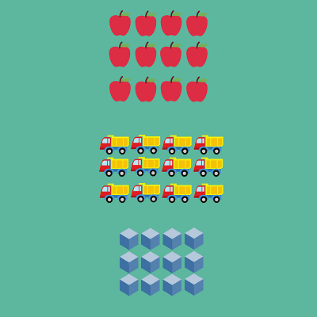

# Arrays

What is an array?  I remember when I first started programming, this was one the most interesting, but somewhat tricky things to get my head around.  So, I am going to try to explain a written description, pictorial one, and code-based one.

An array is a **collection** of like items.  For example, if you think your music collection, you may have playlists (if you have Spotify), or you may have created your playlist from the music you own. Those playlists represent an array of songs. Be mindful we usually don't mix our songs with say a movie playlist.  It doesn't typically make sense.  That is an array of like items.

What does it look like in a picture?



Notice the groups?  There are apples, trucks, and cubes, and not mixed. That is how arrays work. So, you can think of it as an array of apples and only apples, and so on.

How do we do this in code?

```js
    function setup()
    {
        var myFavoriteNumbers = []; 

        var myFavoriteColors = ['red','blue','green','purple'];  // this an array of strings
    }
```

In the first instance, we are just creating an empty array.  We plan on adding only numbers to it (we will look at that later).  In the second array, we create the array and put values in it.  In this case, we add strings automatically.

Next, let's look at why?  Why do we want to use arrays?  The square brackets make some people uncomfortable, so why go through the effort of learning about them?

<a href="https://umontana.zoom.us/recording/share/LOFkpoVEer00PttJq_T3VqQMJBSIFXjmKTopjjPzhGewIumekTziMw" target="_new" style="font-family:Ariel; font-size:32px;">Click here for this section's Video</a>


