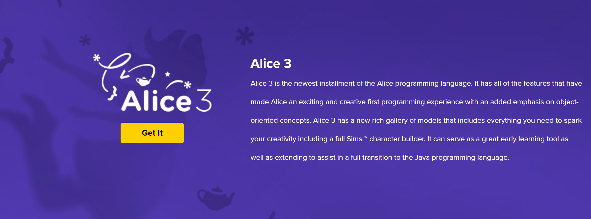

# Alice Download

What you want to do is go to [Alice.org](http://www.alice.org) and get your specific version. All major platforms are supported, and it's free!  There's nothing wrong with that. 

First, click on `Get it`

The screen presents the download options.  Choose the option that fits your configuration. If you have a newer Windows machine, you should have 64-bit; otherwise, 32-bit will work. Just keep in mind that it will run a little slower.

<!-- create video here -->
<a href="https://umontana.zoom.us/recording/share/gU0q5v4Mtu89ncA6kCiJffDRpLl8YaHGUXH2jK_4yAywIumekTziMw" target="_new" style="font-family:Ariel; font-size:32px;">Click here for this section's Video</a>