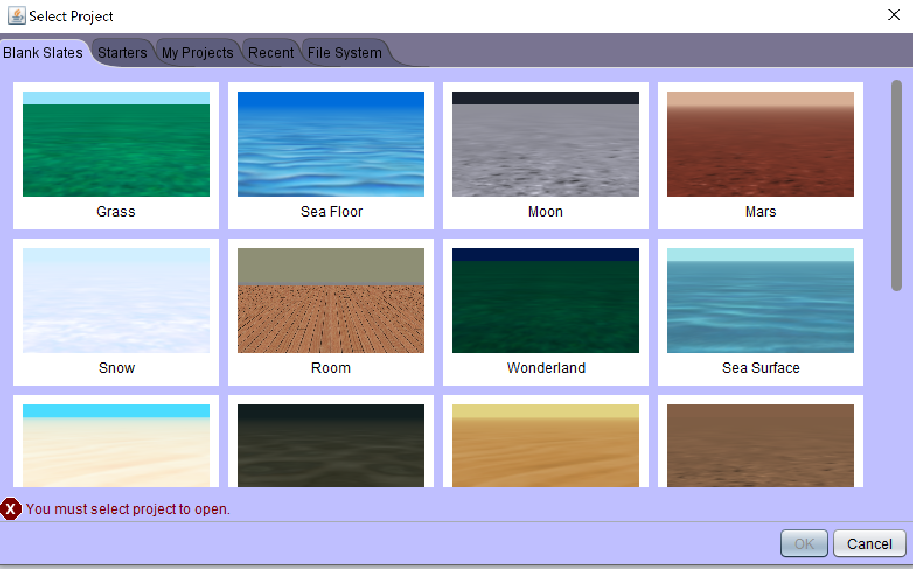

# Create New Project

After you install Alice, you should have a shortcut to the program either on your desktop on a PC or in your Application in your Mac.  Open Alice and you should be presented with a dialog box to create a new project background.
 

 

After choosing a background, you are presented with the main interface.  Watch the video below as I provide an overview of the basic interface.

<!-- video here -->